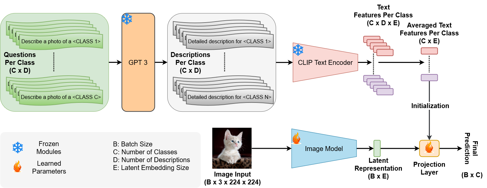
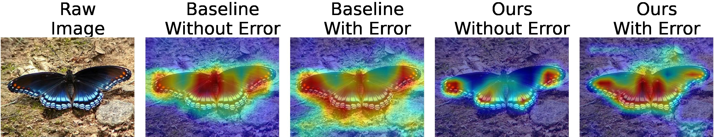
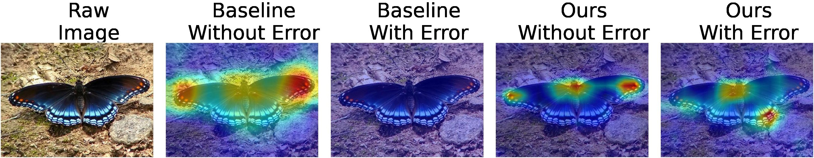
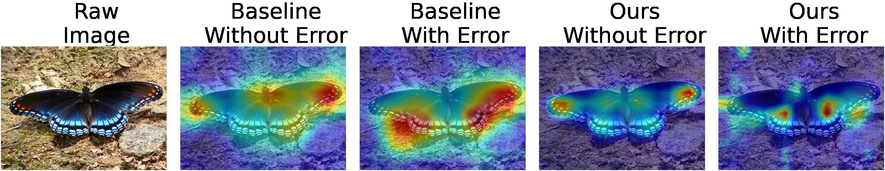
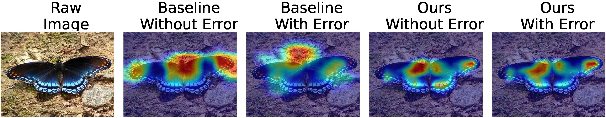

# Hardware Resilience Properties of Text-Guided Image Classifiers [NeurIPS 2023] 

[Syed Talal Wasim](https://talalwasim.github.io),
[Kabila Haile Soboka](https://www.linkedin.com/in/kabila-haile/),
[Abdulrahman Mahmoud](https://ma3mool.github.io/),
[Salman Khan](https://salman-h-khan.github.io/),
[David Brooks](http://www.eecs.harvard.edu/~dbrooks/),
[Gu-Yeon Wei](https://seas.harvard.edu/person/gu-yeon-wei)

[](https://arxiv.org/abs/2311.14062)
<hr />

> **Abstract:**
>*This paper presents a novel method to enhance the reliability of image classification models during deployment in the face of transient hardware errors. By utilizing enriched text embeddings derived from GPT-3 with question prompts per class and CLIP pretrained text encoder, we investigate their impact as an initialization for the classification layer. Our approach achieves a remarkable 5.5x average increase in hardware reliability (and up to 14x) across various architectures in the most critical layer, with minimal accuracy drop (0.3% on average) compared to baseline PyTorch models. Furthermore, our method seamlessly integrates with any image classification backbone, showcases results across various architectures, decreases parameter and FLOPs overhead, and follows a consistent training recipe. This research offers a practical and efficient solution to bolster the robustness of image classification models against hardware failures, with potential implications for future studies in this domain.*

## Table of Contents
<!--ts-->
   * [News](#rocket-News)
   * [Overview](#overview)
   * [Visualization](#comparative-visualization-for-various-backbones-of-baseline-and-our-training-before-and-after-single-bit-flip-error-injection)
   * [Environment Setup](#environment-setup)
   * [Dataset Preparation](#dataset-preparation)
   * [Model Zoo](#model-zoo)
      * [ImageNet Dataset](#imagenet-dataset)
      * [Other Datasets](#other-datasets)
   * [Evaluation](#evaluation)
   * [Training](#training)
   * [Citation](#citation)
   * [Acknowledgements](#acknowledgements)
<!--te-->

## :rocket: News
* **(November 27, 2023)** 
  * Training and evaluation codes are released. Pretrained models will be released soon.
<hr />


## Overview

<p align="center">
  
  <p align="center"><b>The proposed Architecture:</b> D questions for each class (total C) are hand-crafted. These are fed to a GPT-3 model, to obtain D detailed descriptions per class. A CLIP text encoder is used to produce text embeddings, which are averaged across descriptions. The text embeddings initialize a projection layer which is then trained alongside the randomly initialized backbone.</p>
</p>
<hr/>


## Comparative Visualization for Various Backbones of Baseline and Our Training Before and After Single Bit Flip Error Injection. 

<p align="center">
  
  <p align="center"><b>MobileNet-V2</b></p>
</p>

<p align="center">
  
  <p align="center"><b>ResNet-18</b></p>
</p>

<p align="center">
  
  <p align="center"><b>ResNet-34</b></p>
</p>

<p align="center">
  
  <p align="center"><b>ResNet-50</b></p>
</p>


## Environment Setup
Please follow [INSTALL.md](./INSTALL.md) for installation.

## Dataset Preparation

Please follow [DATA.md](./DATA.md) for data preparation.

## Model Zoo

### ImageNet Dataset

| Backbone                | Acc. Baseline | Acc. Ours | Improvement in Reliability (Last Layer) | Improvement in Reliability (Overall) | Improvement in Top2Diff | Download |
|:-----------------------:|:-------------:|:---------:|:---------------------------------------:|:------------------------------------:|:-----------------------:|:--------:|
| Alexnet                 | 56.43%        | 57.28%    | 7.92×                                   | 4.67×                                | 2.83%                   |[baseline]()/[clip]()|
| VGG-16-BN               | 73.45%        | 72.96%    | 14.43×                                  | 9.64×                                | 1.62%                   |[baseline]()/[clip]()|
| VGG-19-BN               | 74.40%        | 74.01%    | 13.29×                                  | 8.67×                                | 1.13%                   |[baseline]()/[clip]()|
| ResNet-18               | 69.60%        | 69.68%    | 2.87×                                   | 1.91×                                | 3.07%                   |[baseline]()/[clip]()|
| ResNet-34               | 73.25%        | 72.62%    | 3.89×                                   | 2.53×                                | 2.08%                   |[baseline]()/[clip]()|
| ResNet-50               | 75.64%        | 74.84%    | 4.48×                                   | 2.96×                                | 3.35%                   |[baseline]()/[clip]()|
| ResNet-101              | 77.25%        | 75.52%    | 4.33×                                   | 2.77×                                | 3.13%                   |[baseline]()/[clip]()|
| ResNet-152              | 77.98%        | 76.18%    | 4.47×                                   | 2.85×                                | 3.09%                   |[baseline]()/[clip]()|
| MobileNet-V2            | 71.87%        | 71.83%    | 3.92x                                   | 2.43x                                | 5.36%                   |[baseline]()/[clip]()|
| MaxVit-T                | 82.98%        | 83.08%    | 2.38x                                   | 1.63x                                | 2.62%                   |[baseline]()/[clip]()|
| Swin-V2-T               | 80.97%        | 80.02%    | 1.65x                                   | 1.07x                                | 2.85%                   |[baseline]()/[clip]()|
| Swin-V2-S               | 82.71%        | 82.86%    | 2.51x                                   | 1.60x                                | 3.04%                   |[baseline]()/[clip]()|
| FocalNet-T              | 80.23%        | 80.77%    | 1.87x                                   | 1.61x                                | 2.61%                   |[baseline]()/[clip]()|
| FocalNet-S              | 82.01%        | 82.52%    | 2.73x                                   | 1.50x                                | 3.10%                   |[baseline]()/[clip]()|

### Other Datasets

| Dataset  | Backbone   | Acc. Baseline | Acc. Ours | Improvement in Reliability (Last Layer) | Improvement in Reliability (Overall) | Improvement in Top2Diff | Download |
|:--------:|:----------:|:-------------:|:---------:|:---------------------------------------:|:------------------------------------:|:-----------------------:|:--------:|
| CIFAR10  | ResNet-50  | 95.07         | 95.29     | 2.04x                                   | 1.71x                                | 6.70%                   |[baseline]()/[clip]()|
| CIFAR10  | FocalNet-T | 94.76         | 94.94     | 2.47x                                   | 1.30x                                | 3.58%                   |[baseline]()/[clip]()|
| CIFAR100 | ResNet-50  | 78.23         | 78.53     | 2.19x                                   | 1.65x                                | 3.69%                   |[baseline]()/[clip]()|
| CIFAR100 | FocalNet-T | 77.06         | 79.21     | 3.21x                                   | 1.58x                                | 2.90%                   |[baseline]()/[clip]()|
| FOOD101  | ResNet-50  | 83.13         | 83.97     | 2.66x                                   | 2.15x                                | 2.78%                   |[baseline]()/[clip]()|
| FOOD101  | FocalNet-T | 85.64         | 85.91     | 3.28x                                   | 2.85x                                | 1.70%                   |[baseline]()/[clip]()|
| STL10    | ResNet-50  | 47.73         | 52.68     | 2.10x                                   | 1.91x                                | 2.45%                   |[baseline]()/[clip]()|
| STL10    | FocalNet-T | 62.74         | 63.78     | 2.23x                                   | 1.72x                                | 1.96%                   |[baseline]()/[clip]()|

## Evaluation

To evaluate pre-trained baseline classifier on ImageNet:

```bash
NETWORK=resnet50
exp_dir=/path/to/log/directory
mkdir -p "${exp_dir}"

python -m test.py \
  --data_path '/path/to/imagenet/' \
  --model ${NETWORK} \
  --checkpoint_path '/path/to/checkpoint' \
2>&1 | tee "${exp_dir}/eval-$(date +"%Y%m%d_%H%M%S").log"
```

To evaluate pre-trained clip based classifier on ImageNet:

```bash
NETWORK=resnet50
exp_dir=/path/to/log/directory
mkdir -p "${exp_dir}"

python -m test.py \
  --data_path '/path/to/imagenet/' \
  --model ${NETWORK} \
  --checkpoint_path '/path/to/checkpoint' \
  --CLIP_model \
  --CLIP_text_path './imagenet_text_features/gpt3.pth' \
  --embed_size 512 \
2>&1 | tee "${exp_dir}/eval-$(date +"%Y%m%d_%H%M%S").log"
```

Modify the `NETWORK`, `exp_dir`, `--data_path` and `--checkpoint_path` arguments accordingly. Note that for the `--CLIP_text_path` argument, the same CLIP text features path has to be provided as used for training the network. For the provided pretrained networks in the model zoo, the `--CLIP_text_path` is always `'./imagenet_text_features/gpt3.pth'`.


## Training

To train a baseline or CLIP text based model, refer to the `scripts` directory which contains scripts to train all the models reported in the paper. Please modify the `--data_path` and `--checkpoint_path` arguments as required. Additionally, all models are trained on four GPUs. If reducing the GPUs or batchsize, please scale the learning-rate linearly accordingly. Note that the effective batchsize is `Number of GPUs x --batch-size`.

Additionally, please note that for training the FocalNet models, we directly utilize the official [FocalNets](https://github.com/microsoft/FocalNet) repository.


## Citation
If you find our work, this repository, or pretrained models useful, please consider giving a star :star: and citation.
```bibtex
@InProceedings{wasim2023textguidedresilience,
    author    = {Wasim, Syed Talal and Soboka, Kabila Haile and Mahmoud, Abdulrahman and Khan, Salman and Brooks, David and Wei, Gu-Yeon},
    title     = {Hardware Resilience Properties of Text-Guided Image Classifiers},
    booktitle = {NeurIPS},
    year      = {2023},
}
```

## Contact
If you have any questions, please create an issue on this repository or contact at wasimtalal@gmail.com or mahmoud@g.harvard.edu.

## Acknowledgements
Our code is based on the [Pytorch Image Classification](https://github.com/pytorch/vision/tree/main/references/classification) repository. Additionally, we utilize [FocalNets](https://github.com/microsoft/FocalNet) repository to train the FocalNet-T and FocalNet-S models, and [pytorchfi](https://github.com/pytorchfi/pytorchfi) and [goldeneye](https://github.com/ma3mool/goldeneye) for resilience analysis. We thank the authors for releasing their code. If you use our code/models/analysis, please consider citing these works as well.
